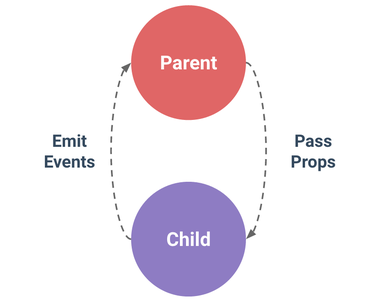
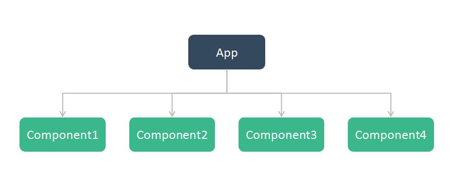
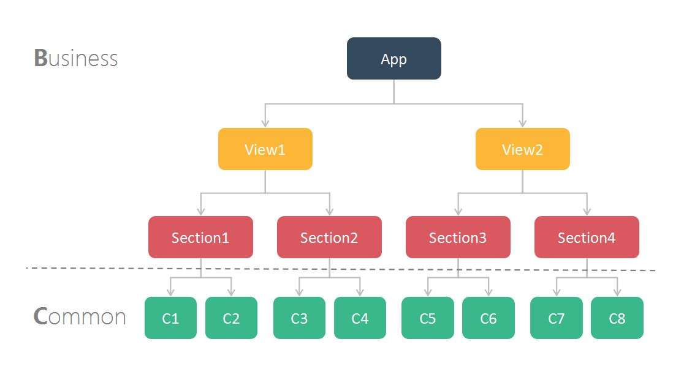

# 打造 Vue.js 可复用组件

<details>
How to build Vue.js reusable component.
</details>


> Vue.js 是一套构建用户界面的渐进式框架。我们可以使用简单的 API 来实现响应式的数据绑定和组合的视图组件。

从维护视图到维护数据，Vue.js 让我们快速地开发应用。但随着业务代码日益庞大，组件也越来越多，组件逻辑耦合严重，使代码维护变得十分困难。

同时，Vue.js 的接口和语法十分自由，实现同一功能有若干种方法。每个人解决问题的思路不一样，写出来的代码也就不一样，缺乏团队内的规范。

本文旨在从组件开发的不同方面列举出合理的解决方法，作为建立组件规范的一个参考。

## 导航

- [构成组件](#sec1)
- [组件间通信](#sec2)
- [业务无关原则](#sec3)
- [命名空间](#sec4)
- [上下文无关原则](#sec5)
- [数据扁平化](#sec6)
- [使用自定义事件实现数据的双向绑定](#sec7)
- [使用自定义 watcher 优化 DOM 操作](#sec8)
- [结构扁平化](#sec9)
- [代码书写规范](#sec10)

## <a id="sec1">构成组件</a>

组件，是一个具有一定功能，且不同组件间功能相对独立的模块。组件可以是一个按钮、一个输入框、一个视频播放器等等。

可复用组件，高内聚、低耦合。

那么，什么构成了组件呢。以浏览器的原生组件 video 为例，分析一下组件的组成部分。

```html
<video
  src="example.mp4"
  width="320"
  height="240"
  onload="loadHandler"
  onerror="errorHandler">
  Your browser does not support the video tag.
</video>
```

实例中能看出，组件由*状态*、*事件*和嵌套的*片断*组成。状态，是组件当前的某些数据或属性，如 video 中的 src、width 和 height。事件，是组件在特定时机触发一些操作的行为，如 video 在视频资源加载成果或失败时会触发对应的事件来执行处理。片段，指的是嵌套在组件标签中的内容，该内容会在某些条件下展现出来，如在浏览器不支持 video 标签时显示提示信息。

在 Vue 组件中，状态称为 props，事件称为 events，片段称为 slots。组件的构成部分也可以理解为组件对外的接口。良好的可复用组件应当定义一个清晰的公开接口。

- **Props** 允许外部环境传递数据给组件
- **Events** 允许组件触发外部环境的副作用
- **Slots** 允许外部环境将额外的内容组合在组件中。

使用 vue 对 video 组件做拓展，构造出一个支持播放列表的组件 myVideo：

```html
<my-video
  :playlist="playlist"
  width="320"
  height="240"
  @load="loadHandler"
  @error="errorHandler"
  @playnext="nextHandler"
  @playprev="prevHandler">
  <div slot="endpage"></div>
</my-video>
```

myVideo 组件有着清晰的接口，接收播放列表、播放器宽高等状态，能够触发加载成功或失败、播放上一个或下一个的事件，并且能自定义播放结束时的尾页，可用于插入广告或显示下一个视频信息。

## <a id="sec2">组件间通信</a>

在 Vue.js 中，父子组件的关系可以总结为 props down, events up 。父组件通过 props 向下传递数据给子组件，子组件通过 events 给父组件发送消息。看看它们是怎么工作的。



## <a id="sec3">业务无关原则</a>

### <a id="sec3-1">命名</a>

组件的命名应该跟业务无关。应该依据组件的功能为组件命名。

例如，一个展示公司部门的列表，把每一项作为一个组件，并命名为 DepartmentItem。这时，有一个需求要展示团队人员列表，样式跟刚刚的部门列表一样。显然，DepartmentItem 这个名字就不适合了。

因此，可复用组件在命名上应避免跟业务扯上关系，以组件的角色、功能对其命名。Item、ListItem、Cell。可以参考 Bootstrap、ElementUI  等一些 UI 框架的命名。

### <a id="sec3-2">业务数据无关</a>

可复用组件只负责 UI 上的展示和一些交互以及动画，如何获取数据跟它无关，因此不要在组件内部去获取数据，以及任何与服务端打交道的操作。可复用组件只实现 UI 相关的功能。

### <a id="sec3-3">组件职责</a>

约束好组件的职责，能让组件更好地解耦，知道什么功能是组件实现的，什么功能不需要实现。

组件可以分为通用组件（可复用组件）和业务组件（一次性组件）。

可复用组件实现通用的功能（不会因组件使用的位置、场景而变化）：
- UI 的展示
- 与用户的交互（事件）
- 动画效果

业务组件实现偏业务化的功能：
- 获取数据
- 和 vuex 相关的操作
- 埋点
- 引用可复用组件

可复用组件应尽量减少对外部条件的依赖，所有与 vuex 相关的操作都不应在可复用组件中出现。

组件应当避免对其父组件的依赖，不要通过 this.$parent 来操作父组件的示例。父组件也不要通过 this.$children 来引用子组件的示例，而是通过子组件的接口与之交互。

## <a id="sec4">命名空间</a>

可复用组件除了定义一个清晰的公开接口外，还需要有命名空间。命名空间可以避免与浏览器保留标签和其他组件的冲突。特别是当项目引用外部 UI 组件或组件迁移到其他项目时，命名空间可以避免很多命名冲突的问题。

```html
<xl-button></xl-button>
<xl-table></xl-table>
<xl-dialog></xl-dialog>
...
```

业务组件也可以有命令空间，跟通用组件区分开。这里用 st (section) 来代表业务组件。

```html
<st-recommend></st-recommend>
<st-qq-movie></st-qq-movie>
<st-sohu-series></st-sohu-series>
```

## <a id="sec5">上下文无关原则</a>

还是上面那句话，可复用组件应尽量减少对外部条件的依赖。没有特别需求且单个组件不至于过重的的前提下，不要把一个有独立功能的组件拆分成若干个小组件。

```html
<table-wrapper>	        
  <table-header slot="header" :headers="exampleHeader"></table-header>	        
  <table-body slot="body" :body-content="exampleContents"></table-body>	      
</table-wrapper>
```

TableHeader 组件和 TableBody 组件依赖当前的上下文，即 TableWrapper 组件嵌套的环境下。你可以有更好的解决办法：

```html
<xl-table :headers="exampleHeader" :body-content="exampleContents"></xl-table>
```

上下文无关原则能够降低组件使用的门槛。

## <a id="sec6">数据扁平化</a>

定义组件接口时，尽量不要将整个对象作为一个 prop 传进来。

```html
<!-- 反例 -->
<card :item="{ title: item.name, description: item.desc, poster: item.img }></card>
```

每个 prop 应该是一个简单类型的数据。这样做有下列几点好处：

- 组件接口清晰
- props 校验方便
- 当服务端返回的对象中的 key 名称与组件接口不一样时，不需要重新构造一个对象

```html
<card
  :title="item.name"
  :description="item.desc"
  :poster="item.img">
</card>
```

扁平化的 props 能让我们更直观地理解组件的接口。

## <a id="sec7">使用自定义事件实现数据的双向绑定</a>

有时候，对于一个状态，需要同时从组件内部和组件外部去改变它。

例如，模态框的显示和隐藏，父组件可以初始化模态框的显示，模态框组件内部的关闭按钮可以让其隐藏。一个好的办法是，使用自定义事件改变父组件中的值：

```html
<modal :show="show" @input="show = argument[0]"></modal>
```

```html
<!-- Modal.vue -->

<template>
  <div v-show="show">
    <h3>标题</h3>
    <p>内容</p>
    <a href="javascript:;" @click="close">关闭</a>
  </div>
</template>

<script>
  export default {
    props: {
      show: String
    },
    methods: {
      close () {
        this.$emit('input', false)
      }
    }
  }
</script>
```

用户点击关闭按钮时，Modal 组件发送一个 input 自定义事件给父组件。父组件监听到 input 事件时，把 show 设置为事件回调的第一个参数。

可以使用语法糖 v-model：

```html
<modal v-model="show"></model>
```

要让组件的 v-model 生效，它必须：

- 接受一个 value 属性
- 在有新的 value 时触发 input 事件

**注意：**由于每个组件的 input 事件只能用来对一个数据进行双向绑定，所以当存在多个需要向上同步的数据时，请不要使用 v-model，请使用多个自定义事件，并在父组件中同步新的值。

## <a id="sec8">使用自定义 watcher 优化 DOM 操作</a>

在开发中，有些逻辑无法使用数据绑定，无法避免需要对 DOM 的操作。例如，视频的播放需要同步 Video 对象的播放操作及组件内的播放状态。可以使用自定义 watcher 来优化 DOM 的操作。

```html
<!-- MyVideo.vue -->

<template>
  <div>
    <video ref="video" src="src"></video>
    <a href="javascript:;" @click="togglePlay">{{ playing ? '暂停' : '播放' }}</a>
  </div>
</template>

<script>
  export default {
    props: {
      src: String // 播放地址
    },
    data () {
      return {
        playing: false // 是否正在播放
      }
    },
    watch: {
      // 播放状态变化时，执行对应操作
      playing (val) {
        let video = this.$refs.video
        if (val) {
          video.play();
        } else {
          video.pause();
        }
      }
    },
    method: {
      // 切换播放状态
      togglePlay () {
        this.playing = !this.playing
      }
    }
  }
</script>
```

示例中，自定义 watcher 在监听到 playing 状态变化时，会执行播放或暂停操作。遇到对视频播放状态的处理时，只需要关注 playing 状态即可。

## <a id="sec9">结构扁平化</a>

单组件不异过重，组件在功能独立的前提下应该尽量简单，越简单的组件可复用性越强。当你实现组件的代码，不包括CSS，有好几百行了（这个大小视业务而定），那么就要考虑拆分成更小的组件。

当组件足够简单时，就可以在一个更大的业务组件中去自由组合这些组件，实现我们的业务功能。因此，理想情况下，组件的引用层级，只有两级。业务组件引用通用组件。



在一个庞大的项目当中，组件间的引用关系会更复杂一些。当单页应用有多个路由，每个路由组件过重，需要拆分模块时。组件结构会变成下图这样。



按照这个思路构建我们的项目，最后的源代码目录结构（不包括构建流程文件）：

```
│  App.vue          # 顶级组件
│  client-entry.js  # 前端入口文件
│  config.js        # 配置文件
│  main.js          # 主入口文件
│  
├─api               # 接口 API
├─assets            # 静态资源
├─components        # 通用组件
├─directives        # 自定义指令
├─mock              # Mock 数据
├─plugins           # 自定义插件
├─router            # 路由配置
├─sections          # 业务组件
├─store             # Vuex Store
├─utils             # 工具模块
└─views             # 路由页面组件
```

在通用组件中还可以区分容器组件、布局组件和其他功能性组件等。

## <a id="sec10">代码书写规范</a>

### 缩进

组件或元素的特性小于三个时，代码写在一行里：

```html
<my-component :prop-a="a" :prop-b="b"></my-component>
```

组件或元素的特性大于等于三个时，代码分行写，一个特性写一行：

```html
<my-component
  :prop-a="a"
  :prop-b="b"
  :prop-c="c">
</my-component>
```

### 事件绑定


